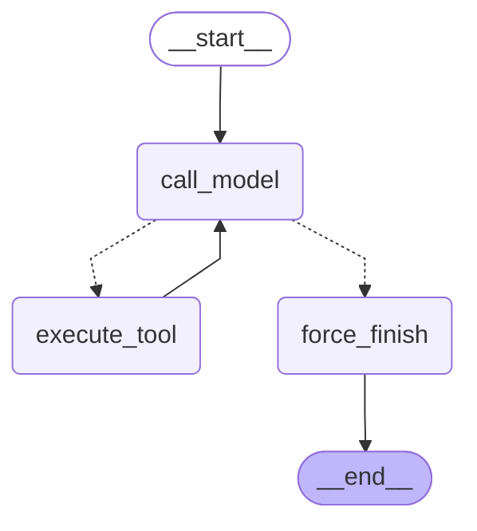

# M6B3: LangGraph основы

## 1. Конфигурация

- LangGraph 1.2.12; LangChain/LangChain Core 1.x; `langchain-openai` 1.x.
- Модель: `gpt-5.4-mini`, temperature `0`; ключ берётся только при реальном
  вызове из `LLM__OPENAI_API_KEY` или `OPENAI_API_KEY`.
- `MAX_ITERATIONS = 6`.
- Tools: `search_knowledge_base`, `get_current_time`,
  `send_telegram_message`. Это те же предметные действия, что и в B6.2;
  отправка Telegram остаётся безопасной заглушкой.

## 2. Контракт state

`AgentState` содержит лишь сериализуемые данные, без клиентов, сессий и
ключей: `messages: Annotated[list[AnyMessage], add_messages]` сохраняет всю
переписку, `iteration_count: int` заменяется значением узла модели, а
`tool_results: Annotated[list[dict], operator.add]` накапливает audit-записи
`name`, `args`, `result`. Такой контракт уже подходит для checkpoint saver.

## 3. Router и остановка

`route_after_model` — чистая функция: при `iteration_count >= 6` она всегда
возвращает `force_finish`; иначе направляет в `execute_tool` только при наличии
`tool_calls`. `force_finish` добавляет явное диагностическое финальное
сообщение, если лимит достигнут во время tool-call. Неизвестный или сломанный
tool становится `ToolMessage` с ошибкой, а не аварией графа.

## 4. Mermaid-схема custom graph

Полные экспортированные схемы: `agent-graph-custom.mmd` и
`agent-graph-prebuilt.mmd`; они генерируются командой
`uv run python scripts/visualize_graph.py`.

## 5. Бенчмарк

Три повтора на задачу, wall-clock `perf_counter`. Это офлайн-прогон реальных
orchestration loop с scripted ChatModel и локальными tools: он исключает сеть,
стоимость API и недетерминизм провайдера. Поэтому latency показывает именно
накладные расходы orchestration; tokens — usage scripted ответов.

<!-- BENCHMARK_TABLE_START -->
| Задача | Реализация | latency_ms (mean 3) | prompt_tokens | completion_tokens | total_steps |
|---|---|---:|---:|---:|---:|
| Простая: найти решение в БЗ | custom | 5.38 | 20 | 8 | 2 |
| Простая: найти решение в БЗ | prebuilt | 5.01 | 20 | 8 | 3 |
| Простая: найти решение в БЗ | naive B6.2 | 2.11 | 22 | 8 | 2 |
| Простая: узнать время в Москве | custom | 3.07 | 20 | 8 | 2 |
| Простая: узнать время в Москве | prebuilt | 3.86 | 20 | 8 | 3 |
| Простая: узнать время в Москве | naive B6.2 | 1.91 | 22 | 8 | 2 |
| Средняя: время, затем поиск связанного обращения | custom | 4.13 | 30 | 12 | 3 |
| Средняя: время, затем поиск связанного обращения | prebuilt | 5.16 | 30 | 12 | 5 |
| Средняя: время, затем поиск связанного обращения | naive B6.2 | 1.94 | 36 | 11 | 3 |
| Средняя: поиск и Telegram-заглушка | custom | 4.54 | 30 | 12 | 3 |
| Средняя: поиск и Telegram-заглушка | prebuilt | 5.13 | 30 | 12 | 5 |
| Средняя: поиск и Telegram-заглушка | naive B6.2 | 1.97 | 36 | 11 | 3 |
| Провокация: отправить без адресата | custom | 1.96 | 10 | 4 | 1 |
| Провокация: отправить без адресата | prebuilt | 2.86 | 10 | 4 | 1 |
| Провокация: отправить без адресата | naive B6.2 | 1.89 | 22 | 7 | 2 |
<!-- BENCHMARK_TABLE_END -->

Команда `uv run python scripts/bench_agents.py` обновляет этот блок таблицы и
одновременно печатает его в терминал.

## 6. Custom и prebuilt

В custom-варианте вручную определены state/reducers, три node, router и явный
iteration guard; это предпочтительный путь для будущих interrupt, audit-узлов,
special routing и supervisor-subgraph. `create_agent` сам строит цикл
model→tools→model и его state, поэтому меньше кода и быстрее начать обычный
ReAct-agent, но отдельный счётчик и stop-политику из custom-пути он не даёт.
В офлайн-измерении prebuilt добавил сообщения tool-цикла (3/5 против 2/3) и
небольшую накладную latency.

## 7. Найденный баг

Первый вариант модуля создавал `ChatOpenAI` без ключа при импорте. Из-за этого
визуализация графа и unit-тесты падали до вызова модели. Модель теперь получает
безопасный placeholder только для construction; реальная конфигурация ключа
по-прежнему нужна, чтобы отправить запрос. Это позволило сделать экспорт и
offline benchmark воспроизводимыми.

## 8. Путь к checkpointing

В benchmark custom graph уже вызывается с
`config={"configurable": {"thread_id": "bench-..."}}`; без saver это no-op.
Для персистентности остаётся выбрать и подключить `AsyncSqliteSaver` либо
`AsyncPostgresSaver` при `compile(checkpointer=...)`, обеспечить миграции и
политику хранения. Контракт state и интерфейс вызова менять не потребуется.
