# Архитектурный паспорт проекта

## 1. Назначение документа

Этот документ фиксирует текущую архитектурную рамку проекта и служит отправной точкой для следующих итераций:

- реализация слоёв в FastAPI;
- подключение observability: logs, metrics, traces;
- подключение Telegram-бота / Яндекс.Мессенджер-бота к Service-слою;
- добавление RAG в Data-слой;
- развитие fault tolerance вокруг локальных LLM через Ollama.

Проект строится как чат-бот / FAQ / RAG-сервис с локальными LLM. Внешние LLM-провайдеры в базовой архитектуре не используются. Основной LLM runtime — Ollama.

---

## 2. Диаграмма компонентов

```mermaid
flowchart LR
    %% Client layer
    USER["<b>Клиент</b><br/>Telegram / Яндекс.Мессенджер<br/><br/>latency-critical:<br/>ожидает быстрый первый ответ"]

    %% Gateway layer
    subgraph GATEWAY["API Gateway Layer"]
        GW["<b>nginx</b><br/>TLS termination<br/>routing<br/>request size limit"]
        AUTH["<b>Auth</b><br/>bot token / webhook secret<br/>basic access rules"]
        RL["<b>Rate Limit</b><br/>IP / user / chat limits<br/>Redis-backed counters"]
    end

    %% Service layer
    subgraph SERVICE["Service Layer"]
        API["<b>FastAPI</b><br/>/chat/stream<br/>/chat<br/>/health<br/>/metrics"]
        ORCH["<b>Request Orchestrator</b><br/>routing<br/>prompt assembly<br/>policy checks<br/>stream lifecycle"]
        ADAPTER["<b>Transport Adapter</b><br/>SSE for web/API<br/>typing/status for messengers<br/>edit message / chunks"]
        BULK["<b>Bulkhead</b><br/>semaphores per endpoint<br/>semaphores per LLM class"]
        CB_OLLAMA["<b>Circuit Breaker</b><br/>Ollama instance health<br/>open / half-open / closed"]
        CB_FAST["<b>Circuit Breaker</b><br/>fast local model<br/>latency-critical calls"]
        CB_BIG["<b>Circuit Breaker</b><br/>quality local model<br/>cost-critical calls"]
        CB_EMB["<b>Circuit Breaker</b><br/>embedding model<br/>RAG/cache calls"]
        FALLBACK["<b>Fallback chain</b><br/>1. semantic cache<br/>2. fast local model<br/>3. quality model<br/>4. smaller emergency model<br/>5. FAQ/template answer"]
    end

    %% LLM layer
    subgraph LLM["LLM Layer: local only"]
        OLLAMA["<b>Ollama runtime</b><br/>local HTTP API<br/>GPU/CPU inference"]
        MODEL_Q["<b>Quality model</b><br/>gemma/qwen class<br/>cost-critical:<br/>GPU time, RAM, tokens"]
        MODEL_F["<b>Fast model</b><br/>small qwen/gemma class<br/>latency-critical:<br/>short answers, routing"]
        MODEL_E["<b>Embedding model</b><br/>bge-m3 or equivalent<br/>RAG + semantic cache"]
    end

    %% Data layer
    subgraph DATA["Data Layer"]
        REDIS["<b>Redis</b><br/>sessions<br/>rate limit cache<br/>idempotency keys<br/>short TTL cache"]
        PG["<b>Postgres</b><br/>chat history<br/>audit log<br/>feedback<br/>file metadata<br/>metrics snapshots"]
        QDRANT["<b>Qdrant</b><br/>vector index<br/>semantic cache<br/>RAG chunks"]
        MINIO["<b>Object Storage</b><br/>MinIO<br/>S3-compatible API<br/>files, uploads, RAG sources<br/>not in critical path for text chat"]
    end

    %% Request flow
    USER -->|1. message / webhook| GW
    GW --> AUTH --> RL -->|2. validated request| API
    API --> ORCH
    ORCH --> BULK

    BULK -->|3. check session / limits| REDIS
    BULK -->|4. retrieve context| PG
    BULK -->|5. RAG search / cache lookup| QDRANT
    QDRANT -->|cache hit: return answer| ORCH
    QDRANT -.->|cache miss| FALLBACK

    FALLBACK --> CB_OLLAMA
    CB_OLLAMA -->|runtime ok| CB_FAST
    CB_OLLAMA -->|runtime ok| CB_BIG
    CB_OLLAMA -->|runtime ok| CB_EMB

    CB_FAST -->|generate stream| OLLAMA
    CB_BIG -->|generate stream| OLLAMA
    CB_EMB -->|embedding request| OLLAMA
    OLLAMA --> MODEL_F
    OLLAMA --> MODEL_Q
    OLLAMA --> MODEL_E

    MODEL_F -->|latency-critical stream| ORCH
    MODEL_Q -->|cost-critical / quality stream| ORCH
    ORCH -->|6. save history / metrics| PG
    ORCH -->|7. update cache / TTL| REDIS
    ORCH -->|8. stream events| ADAPTER
    ADAPTER -->|SSE / chunks / message edits| API --> GW --> USER

    %% Storage flow
    ORCH -.->|only for files/RAG uploads| MINIO
    MINIO -.->|indexing input: source documents| QDRANT

    %% Styles
    style USER fill:#eef2ff,stroke:#6366f1,stroke-width:2px
    style GATEWAY fill:#ecfdf5,stroke:#10b981,stroke-width:2px
    style SERVICE fill:#eef2ff,stroke:#6366f1,stroke-width:2px
    style LLM fill:#fff7ed,stroke:#f97316,stroke-width:2px
    style DATA fill:#fefce8,stroke:#f59e0b,stroke-width:2px
    style FALLBACK fill:#fee2e2,stroke:#ef4444,stroke-width:2px
    style CB_OLLAMA fill:#fee2e2,stroke:#ef4444,stroke-width:2px
    style CB_FAST fill:#fee2e2,stroke:#ef4444,stroke-width:2px
    style CB_BIG fill:#fee2e2,stroke:#ef4444,stroke-width:2px
    style CB_EMB fill:#fee2e2,stroke:#ef4444,stroke-width:2px
```



---

## 3. Комментарий по LLM fallback chain

Так как проект использует только локальные LLM через Ollama, fallback chain не должен выглядеть как `OpenAI -> Anthropic -> Ollama`. Это создаёт ложное архитектурное обещание.

Правильная цепочка для локального варианта:

1. **Semantic cache** - быстрый возврат ранее рассчитанного ответа при высокой близости запроса.
2. **Fast local model** - компактная модель для latency-critical сценариев: короткие ответы, классификация, маршрутизация, FAQ.
3. **Quality local model** - более тяжёлая модель для задач, где важнее качество ответа, чем скорость.
4. **Smaller emergency model** - резервная компактная модель, если основная модель перегружена или падает по timeout/OOM.
5. **FAQ/template fallback** - безопасный шаблонный ответ, если LLM-слой недоступен целиком.

Circuit Breaker ставится не «на LLM вообще», а на конкретный ресурс:

- на Ollama runtime как локальный inference-сервис;
- на fast model, если она вызывается отдельным маршрутом/профилем;
- на quality model, если она имеет отдельные лимиты timeout/concurrency;
- на embedding model, если RAG и semantic cache критичны для ответа.

---

## 4. Роль MinIO / S3-compatible object storage

`MinIO` на схеме — это объектное хранилище для файлового контура. Это не замена Postgres, Redis или Qdrant. В базовой локальной архитектуре корректная формулировка: **MinIO как S3-compatible object storage**, а не внешний AWS S3.

MinIO нужен для хранения:

- вложений из Telegram / Яндекс.Мессенджера;
- документов, загруженных пользователем для RAG;
- PDF, DOCX, изображений и архивов;
- исходных файлов, из которых потом строятся chunks и embeddings;
- крупных артефактов, которые не нужно складывать в Postgres.

Разделение ответственности:

| Компонент | За что отвечает                                                       |
| --------- | --------------------------------------------------------------------- |
| Postgres  | история чата, audit log, feedback, metadata файлов, статусы обработки |
| Redis     | сессии, rate limit, idempotency keys, short TTL cache                 |
| Qdrant    | vector index, semantic cache, RAG chunks                              |
| MinIO     | бинарные файлы, вложения, исходники документов для RAG                |

Для обычного текстового чата MinIO **не находится в критическом пути**. Поток остаётся таким:

```text
Client → Gateway → Service → Semantic cache / Qdrant → Ollama → Stream response
```

Для сценария с файлом или RAG ingestion поток другой:

```text
Client → Gateway → Service
                 ↓
              MinIO: сохранить исходный файл
                 ↓
              Postgres: сохранить metadata файла
                 ↓
              Worker/parser: извлечь текст
                 ↓
              Qdrant: сохранить chunks + embeddings
                 ↓
              Ollama: ответить с RAG-контекстом
```

При отказе MinIO сервис должен деградировать так:

- текстовый чат продолжает работать;
- загрузка файлов временно отключается;
- RAG по уже проиндексированным chunks в Qdrant продолжает работать частично;
- открытие оригинального документа и переиндексация откладываются;
- пользователь получает понятное сообщение: «Файловый контур временно недоступен, но текстовый запрос обработать могу».

На схеме MinIO показан пунктирной связью, потому что он участвует только в файловых/RAG-сценариях, а не в каждом текстовом запросе.

---

## 5. ADR-001: основной паттерн взаимодействия

### Status

Accepted

### Context

Проект реализует чат-бот / FAQ / RAG-сервис. Основной сценарий — пользователь отправляет вопрос через Telegram или Яндекс.Мессенджер, сервис проверяет semantic cache, при необходимости собирает RAG-контекст и вызывает локальную LLM через Ollama.

Ключевая UX-проблема: ответы в большинстве случаев будут длинными. Если пользователь ждёт полный ответ одним сообщением, интерфейс выглядит зависшим: нет первого токена, нет признака прогресса, непонятно, работает ли бот. Для мессенджера это плохой сценарий: пользователь начинает повторять запрос, закрывает чат или считает сервис сломанным.

Ожидаемый профиль нагрузки для первой версии:

- 10–60 RPM на входе;
- 5 000–50 000 TPM суммарной локальной генерации;
- средний входной запрос: 300–1 500 токенов с учётом системного промпта и RAG-контекста;
- средний ответ: 500–2 000 токенов;
- часть запросов latency-critical: короткий FAQ, routing, классификация, первый пользовательский feedback о начале обработки;
- часть запросов cost-critical: длинные ответы, RAG, анализ документов, где цена выражается не в оплате API, а в GPU time, RAM и очереди ожидания.

### Decision

Для основной версии выбран паттерн **Streaming-first**.

Базовый поток:

1. Клиент отправляет сообщение в мессенджер.
2. Gateway передаёт webhook/request в FastAPI.
3. Service быстро возвращает признак начала обработки: typing/status, черновое сообщение или первый chunk.
4. Service вызывает semantic cache/RAG/LLM.
5. LLM-ответ отдаётся потоком токенов или смысловыми чанками.
6. Messenger adapter превращает поток в транспорт мессенджера: редактирование одного сообщения, отправка чанков или финальная сборка ответа, если платформа не поддерживает нормальное потоковое обновление.

Для web/API-клиента основной транспорт — **SSE** (`text/event-stream`). Для Telegram/Яндекс.Мессенджера streaming реализуется как **прикладной streaming**: backend получает токены потоком, а адаптер дозированно обновляет сообщение или отправляет части ответа.

Request-Response остаётся вспомогательным паттерном для:

- `/health`;
- `/metrics`;
- коротких служебных команд;
- cache hit, когда готовый ответ возвращается сразу;
- внутренних операций без длинной генерации.

### Consequences

Что выигрываем:

- пользователь быстро видит, что бот живой и запрос обрабатывается;
- длинный ответ начинает приходить раньше, без ожидания полной генерации;
- проще обрывать генерацию при disconnect/cancel;
- меньше риск повторных пользовательских запросов из-за тишины;
- лучше UX для RAG-ответов и больших инструкций.

Что усложняется:

- nginx должен пропускать streaming без буферизации;
- нужны отдельные timeout для первого токена и полного ответа;
- логирование должно учитывать stream lifecycle: `stream_started`, `first_token_ms`, `stream_completed`, `stream_aborted`;
- retry становится аккуратнее: повторять весь stream после частичного ответа нельзя без idempotency и явной политики;
- messenger adapter должен ограничивать частоту обновлений, иначе упрёмся в лимиты платформы;
- для длинных сообщений нужно резать ответ на чанки и корректно собирать финальный текст.

### Implementation notes

Для nginx/FastAPI нужно заложить:

- `proxy_buffering off` для streaming endpoint;
- увеличенный `proxy_read_timeout` для `/chat/stream`;
- heartbeat/event comment, чтобы соединение не выглядело мёртвым;
- отдельный endpoint `/chat/stream` для SSE;
- fallback endpoint `/chat` для обычного Request-Response;
- cancellation handling: если клиент отвалился, Service прекращает генерацию в Ollama, насколько это поддерживается клиентом.

Для мессенджеров нужно заложить транспортный адаптер:

- сразу отправить короткое сообщение вида «Принял, готовлю ответ…» или включить typing/status;
- обновлять сообщение не на каждый токен, а батчами, например раз в 1–3 секунды или по накоплению смыслового чанка;
- финальный ответ сохранить в Postgres целиком;
- если поток оборвался, отправить аккуратное завершение: «Ответ оборвался, ниже последняя полученная часть».

### Alternatives considered

#### Request-Response

Отклонён как основной паттерн.

Причина: для длинных LLM-ответов пользователь слишком долго не видит прогресс. Технически backend работает, но UX выглядит как зависание. Это особенно плохо для мессенджера, где пользователь не видит сетевой индикатор HTTP-запроса.

Оставлен как вспомогательный паттерн для коротких операций, health-check, metrics, cache hit и служебных команд.

#### Queue-based

Отклонён для обычного интерактивного чата первой версии.

Причина: очередь хорошо подходит для тяжёлой batch-обработки, индексации документов и фонового прогрева кэша, но для живого диалога добавляет задержку, worker’ы, job table, polling/status endpoint и отдельную обработку повторов.

Queue-based стоит использовать отдельно для:

- batch-обработки документов;
- RAG ingestion;
- массового пересчёта embeddings;
- фонового прогрева semantic cache.

#### Fan-out

Отклонён для основной генерации.

Причина: при локальных LLM fan-out резко увеличивает расход GPU/RAM. Его стоит применять точечно: например, для rerank, классификации или проверки ответа, но не для каждого пользовательского запроса.

## 6. ADR-002: стратегия fault tolerance для локальных LLM

### Status

Accepted

### Context

LLM-слой работает локально через Ollama. Главные риски:

- Ollama runtime недоступен;
- тяжёлая модель долго отвечает;
- GPU/RAM перегружены;
- модель падает по timeout;
- embedding model недоступна, из-за чего страдает semantic cache и RAG.

Так как внешние провайдеры не используются, отказоустойчивость строится внутри локального inference-контура.

### Decision

Выбрана стратегия:

1. **Primary**: локальная quality model через Ollama для сложных RAG/чат-запросов.
2. **Latency fallback**: fast local model для коротких запросов и случаев, когда quality model недоступна или перегружена.
3. **Emergency fallback**: smaller local model с коротким timeout и ограничением max tokens.
4. **Non-LLM fallback**: semantic cache или FAQ/template answer.
5. **Circuit Breaker**: отдельно на Ollama runtime и на каждый профиль модели.
6. **Bulkhead**: отдельные семафоры для latency-critical и cost-critical запросов.

### Consequences

Что выигрываем:

- отказ одной тяжёлой модели не валит весь сервис;
- короткие запросы не блокируются длинными генерациями;
- сервис сохраняет контролируемый ответ даже при полном отказе LLM;
- понятнее метрики: видно, какая модель деградирует.

Что усложняется:

- нужны разные timeout, concurrency и max_tokens для классов моделей;
- требуется health-check Ollama и прогрев моделей;
- нужно хранить причину fallback в логах и метриках;
- качество ответа становится неоднородным: fallback-модель отвечает проще и короче.

### Alternatives considered

#### Один локальный LLM без fallback

Отклонён.

Причина: один тяжёлый локальный runtime становится single point of failure. При зависании модели сервис теряет способность отвечать даже на простые FAQ-запросы.

#### Внешние LLM как fallback

Отклонены для базовой версии.

Причина: текущая архитектурная граница проекта - локальные LLM. Внешние провайдеры добавляют вопросы стоимости, приватности, сетевой доступности и отдельной политики хранения данных.

---

## 7. Потенциальные точки отказа

| Слой                  | Что ломается                                            | Что произойдёт                                                                                                            | Паттерн смягчения                                                          | Graceful degradation                                                                                                                                                  |
| --------------------- | ------------------------------------------------------- | ------------------------------------------------------------------------------------------------------------------------- | -------------------------------------------------------------------------- | --------------------------------------------------------------------------------------------------------------------------------------------------------------------- |
| Client                | Telegram/Яндекс.Мессенджер недоступен                   | Пользователь не доставит сообщение или не получит ответ                                                                   | Retry на стороне платформы, idempotency key                                | Сервис продолжает работать, новые сообщения принимаются после восстановления транспорта                                                                               |
| API Gateway           | nginx недоступен                                        | Входной трафик не попадает в FastAPI                                                                                      | Health-check, restart policy, reverse proxy failover в будущем             | Сервис недоступен извне, внутренние слои не повреждаются                                                                                                              |
| API Gateway streaming | nginx буферизует stream или режет long-lived соединение | Пользователь не видит частичный ответ или получает обрыв                                                                  | `proxy_buffering off`, отдельные timeout для `/chat/stream`, heartbeat     | Service продолжает генерацию; adapter отправляет финальный или частичный ответ чанками                                                                                |
| Auth                  | Ошибка проверки токена/webhook secret                   | Валидные запросы отклоняются или невалидные проходят                                                                      | Явная конфигурация секретов, smoke-test webhook                            | При fail-closed сервис возвращает 401/403 и не вызывает LLM                                                                                                           |
| Rate limit            | Redis для лимитов недоступен                            | Нельзя корректно считать лимиты                                                                                           | Fail-open или fail-closed по политике риска                                | Для внутреннего контура — fail-open с жёстким per-process лимитом; для публичного — fail-closed                                                                       |
| Service               | FastAPI падает                                          | Запросы не обрабатываются                                                                                                 | Process supervisor, health-check, stateless service                        | После рестарта состояние берётся из Redis/Postgres                                                                                                                    |
| Orchestrator          | Ошибка сборки prompt/RAG-контекста                      | Ответ не формируется или формируется без контекста                                                                        | Validation, fallback prompt, safe defaults                                 | Возврат короткого ответа без RAG с пометкой о неполном контексте                                                                                                      |
| Bulkhead              | Все семафоры заняты                                     | Новые запросы ждут или отклоняются                                                                                        | Ограничение очереди, timeout, 429/503                                      | Latency-critical запросы идут через отдельный лимит, тяжёлые запросы отклоняются первыми                                                                              |
| Semantic cache        | Qdrant недоступен                                       | Нет cache hit и vector search                                                                                             | Timeout + bypass cache                                                     | Запрос идёт напрямую в LLM без semantic cache/RAG                                                                                                                     |
| Embedding model       | Embeddings не считаются                                 | RAG и semantic cache не работают                                                                                          | Circuit Breaker на embedding model                                         | Ответ строится без RAG или по keyword fallback, если он добавлен                                                                                                      |
| Ollama runtime        | Ollama не отвечает                                      | Локальные модели недоступны                                                                                               | Circuit Breaker на Ollama runtime                                          | Возврат FAQ/template ответа, сохранение инцидента в Postgres                                                                                                          |
| Quality model         | Тяжёлая модель зависла или перегружена                  | Длинные ответы тормозят                                                                                                   | Circuit Breaker + timeout + fallback на fast model                         | Ответ короче и проще, но пользователь получает результат                                                                                                              |
| Fast model            | Быстрая модель недоступна                               | Routing/короткие ответы замедляются                                                                                       | Circuit Breaker + fallback на quality/smaller model                        | Часть быстрых запросов обслуживается медленнее                                                                                                                        |
| Redis                 | Сессии и short TTL cache недоступны                     | Потеря краткосрочного состояния, rate limit cache                                                                         | Local in-memory fallback с коротким TTL                                    | Чат теряет часть контекста, но сервис отвечает через Postgres/RAG                                                                                                     |
| Postgres              | История/аудит недоступны                                | Нельзя сохранить историю и метрики                                                                                        | Retry, write-behind buffer в будущем                                       | Ответ пользователю возвращается, но история временно не сохраняется                                                                                                   |
| MinIO object storage  | Документы, вложения и исходники для RAG недоступны      | Обычный текстовый чат продолжает работать; загрузка файлов, скачивание оригиналов и переиндексация документов не работают | Retry, metadata check, delayed indexing, feature flag на файловые операции | Текстовые запросы работают; RAG по уже проиндексированным chunks в Qdrant работает частично; пользователю отдаётся сообщение, что файловый контур временно недоступен |
| Observability         | Метрики/трейсы не пишутся                               | Сервис работает, но диагностика слепнет                                                                                   | Local logs, structured logging                                             | Ответы продолжаются, но incident response ухудшается                                                                                                                  |

---

## Использование LiteLLM

В данной версии проекта используется прямой вызов Ollama через внутренний `LLMClient`. LiteLLM не включается в обязательный runtime, чтобы не добавлять лишний инфраструктурный слой. Архитектура оставляет точку расширения для подключения LiteLLM как LLM Gateway при появлении требований к централизованному routing, fallback, лимитам, observability или гибридному использованию локальных и облачных моделей.
