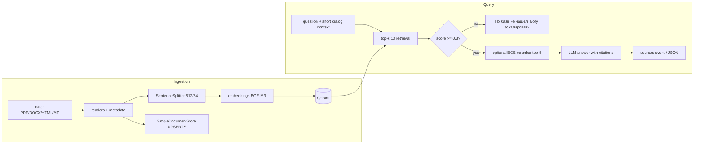

# Корпоративный RAG-ассистент (M5B5)

## Параметры и защита от галлюцинаций

Используется recursive `SentenceSplitter(chunk_size=512, chunk_overlap=64)`, top-k 10.
Опциональный cross-encoder — `BAAI/bge-reranker-v2-m3`, top-n 5. Порог
`RAG_SCORE_THRESHOLD=0.3` — стартовая точка для cosine BGE-M3: в текущем small corpus
нерелевантные запросы лежат ниже этого уровня, а релевантные вопросы из golden-набора — выше.
Его нужно калибровать на `eval/golden_dataset.json` при смене embedding-модели. До вызова LLM
работает score-guard, а системный prompt повторяет правило честного отказа.

## API

- `POST /rag/query` — синхронный ответ: `answer`, `confident`, `top_score`, `sources`.
- `POST /documents/upload` — PDF/DOCX/HTML/MD/TXT, сохраняет файл и ставит UPSERT-indexing в background, `202`.
- `POST /chats/{id}/messages` — JSON SSE `token`, финальные `sources` и `done`; короткий follow-up получает контекст предыдущих реплик для retrieval.

Запуск: `uv run python scripts/ingest.py data`. Повторный запуск использует
`SimpleDocumentStore` + `DocstoreStrategy.UPSERTS` и не добавляет неизменённые документы.
